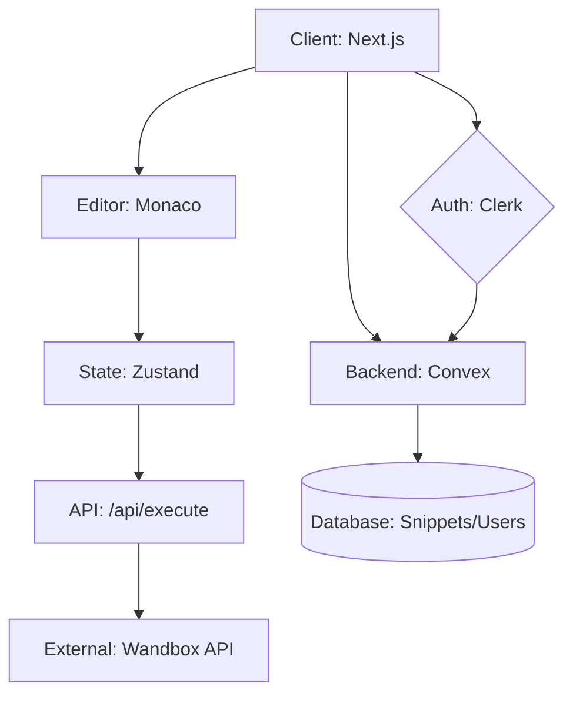

<div align="center">

# ⌨️ Code Craft IDE
**The Ultimate Online Code Editor & Compiler**

`Next.js 16` • `Monaco Editor` • `Convex` • `Clerk` • `Wandbox API`

[](https://nextjs.org)
[](https://www.typescriptlang.org)
[](https://tailwindcss.com)
[](https://convex.dev)
[](https://clerk.com)

---
**`~/.config/nvim/init.lua`** $\rightarrow$ **`code-craft/ide/compiler`**
</div>

## 📝 Description

**Code Craft** is a high-performance, cloud-native Integrated Development Environment (IDE) designed for developers who need a seamless transition between writing, executing, and sharing code. By leveraging the **Monaco Editor** (the engine powering VS Code) and the **Wandbox API**, Code Craft provides a real-time compilation experience for multiple languages without the overhead of local environment setup.

It integrates a robust backend via **Convex** for real-time data synchronization and **Clerk** for secure authentication, allowing users to save snippets, manage profiles, and collaborate through a social coding ecosystem.

---

## 🗺️ Interactive TOC

- [🚀 Features](#-features)
- [🛠️ Tech Stack](#️-tech-stack)
- [⚙️ Installation](#️-installation)
- [⌨️ "Vim-Style" Configuration](#-vim-style-configuration)
- [📂 Architecture](#-architecture)
- [🔌 API Integration](#-api-integration)
- [🤝 Contributing](#-contributing)
- [📜 License](#-license)

---

## 🚀 Features

| Feature | Description | Status |
| :--- | :--- | :---: |
| **Multi-Language Support** | Support for C++, Python, Java, Rust, Go, JS, TS, and more via Wandbox. | ✅ |
| **Cloud Execution** | Remote code execution with real-time output streaming. | ✅ |
| **Snippet Management** | Save, star, and organize code snippets in a cloud database. | ✅ |
| **Real-time Sync** | Instant state updates powered by Convex. | ✅ |
| **Intellisense** | Advanced syntax highlighting and autocompletion via Monaco. | ✅ |
| **Social Coding** | Public profiles, snippet sharing, and commenting system. | ✅ |
| **Modern UI** | Built with Tailwind CSS v4 and Framer Motion for fluid animations. | ✅ |

---

## 🛠️ Tech Stack

```lua
-- System Dependencies
local tech_stack = {
  frontend = {
    framework = "Next.js 16 (App Router)",
    styling = "Tailwind CSS v4",
    editor = "Monaco Editor",
    state_management = "Zustand",
    animations = "Framer Motion",
  },
  backend = {
    database = "Convex (Real-time)",
    auth = "Clerk Auth",
    execution_engine = "Wandbox API",
    hosting = "Vercel",
  },
  languages = {
    primary = "TypeScript",
    runtime = "Node.js",
  }
}
```

---

## ⚙️ Installation

```bash
# 1. Clone the repository
git clone https://github.com/dharunkumar-sh/code-craft.git
cd code-craft

# 2. Install dependencies
npm install

# 3. Set up environment variables
# Create a .env.local file with the following:
NEXT_PUBLIC_CLERK_PUBLISHABLE_KEY=your_clerk_pub_key
CLERK_SECRET_KEY=your_clerk_secret_key
CONVEX_DEPLOYMENT=your_convex_deployment_url

# 4. Start the development server
npm run dev
```

---

## ⌨️ "Vim-Style" Configuration

Since this IDE is designed for power users, we've conceptualized the internal logic as a Neovim configuration.

### ⌨️ Keybindings (Conceptual)
| Action | Command | Logic |
| :--- | :--- | :--- |
| **Run Code** | `Ctrl + Enter` | `RunButton.tsx` $\rightarrow$ `/api/execute` |
| **Save Snippet** | `Ctrl + S` | `useCodeEditorStore` $\rightarrow$ `convex/snippets.ts` |
| **Change Theme** | `Alt + T` | `ThemeSelector.tsx` $\rightarrow$ Zustand Store |
| **Share Code** | `Ctrl + Shift + P` | `ShareSnippetDialog.tsx` |

### 🧩 Lazy Loading & Optimization
The project implements a "Lazy-Load" pattern similar to `lazy.nvim` to ensure maximum performance:
- **Skeletons**: `EditorPanelSkeleton` and `RunningCodeSkeleton` prevent layout shift during async fetches.
- **Client Providers**: `ConvexClientProvider` and `SyncUser` wrap the app to ensure global state availability without redundant re-renders.
- **Route Segments**: Use of `(root)` and `[id]` dynamic routing for optimized page delivery.

---

## 📂 Architecture



<details>
<summary><b>View Full Folder Structure</b></summary>

```text
code-craft/
├── app/
│   ├── (root)/
│   │   ├── _components/      # Core IDE Components (Editor, Output, Header)
│   │   └── page.tsx          # Main IDE Entry
│   ├── api/
│   │   └── execute/          # Backend proxy for code execution
│   ├── profile/              # User profiles and saved snippets
│   └── snippets/             # Dynamic snippet viewing and commenting
├── convex/                   # Backend Functions & Schema
│   ├── schema.ts             # Database definitions
│   ├── snippets.ts           # Snippet CRUD logic
│   └── auth.config.ts        # Clerk-Convex integration
├── store/                    # Zustand state management
├── types/                    # TypeScript interfaces
└── public/                   # Language icons & assets
```
</details>

---

## 🔌 API Integration

### Execution Flow
The application uses a proxy route to handle code execution to protect API keys and manage request headers.

**Endpoint:** `POST /api/execute`

**Request Payload:**
```json
{
  "language": "python",
  "code": "print('Hello World')",
  "version": "3.11"
}
```

**Response:**
```json
{
  "stdout": "Hello World\n",
  "stderr": "",
  "exit_code": 0
}
```

---

## 🤝 Contributing

1. **Fork** the repository.
2. **Create** a feature branch: `git checkout -b feature/amazing-feature`.
3. **Commit** your changes: `git commit -m 'Add some amazing feature'`.
4. **Push** to the branch: `git push origin feature/amazing-feature`.
5. **Open** a Pull Request.

---

## 📜 License

This project is currently unlicensed. Please contact the author for permission to use or modify the code.

<div align="center">
  <sub>Built with ❤️ for the Developer Community</sub>
</div>
